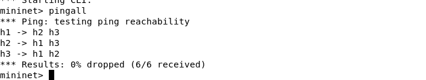
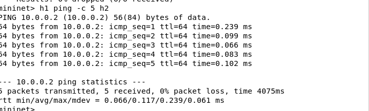
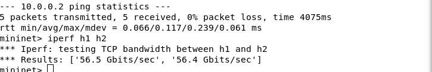
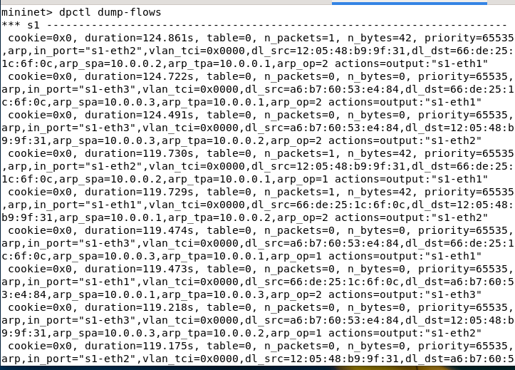
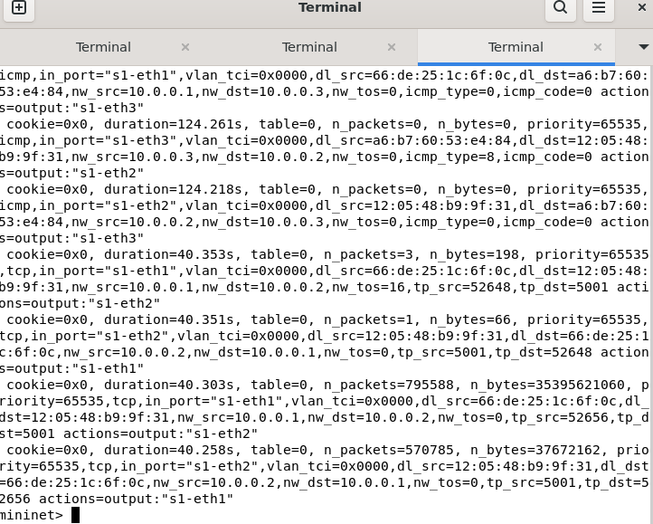
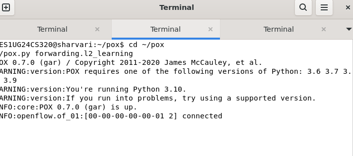
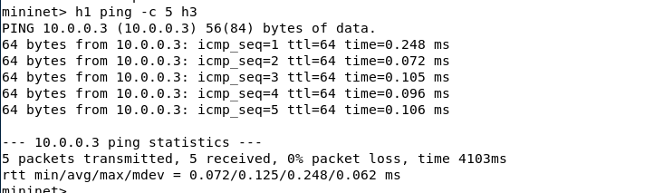
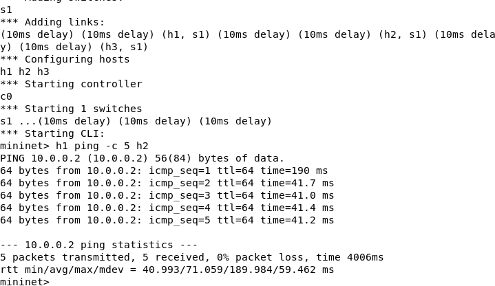
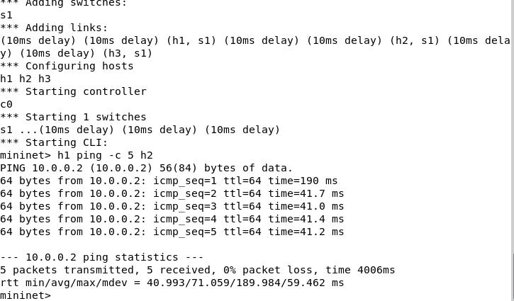

# SDN Network Delay Measurement Tool (Mininet + POX)

## Problem Statement

The objective of this project is to implement an SDN-based network using Mininet and a POX controller to measure network delay (RTT), analyze delay variations, and observe flow rule behavior.

---

## Setup and Execution

### Step 1: Start POX Controller

```bash
cd ~/pox
./pox.py forwarding.l2_learning
```

### Step 2: Run Mininet Topology

```bash
sudo mn --topo single,3 --controller remote
```

---

## Experiments and Results

### 1. Connectivity Test

```bash
pingall
```

All hosts are reachable with 0% packet loss.

---

### 2. Delay Measurement (Normal Network)

```bash
h1 ping -c 5 h2
```

Observed Output:

* Minimum RTT ≈ 0.09 ms
* Average RTT ≈ 0.13 ms
* Maximum RTT ≈ 0.26 ms

---

### 3. Path Comparison

```bash
h1 ping -c 5 h3
h2 ping -c 5 h3
```

Observation:

* Similar RTT values across all host pairs
* All hosts are connected through a single switch

---

### 4. Throughput Measurement

```bash
iperf h1 h2
```

Observed Output:

* Throughput ≈ 53 Gbps

---

### 5. Flow Table Observation

```bash
dpctl dump-flows
```

Observation:

* Flow rules for ARP, ICMP, and TCP are installed dynamically
* Packet and byte counts are recorded

---

## Experimental Variation (With Link Delay)

### Run topology with delay

```bash
sudo mn --topo single,3 --link tc,delay=10ms --controller remote
```

### Measure delay

```bash
h1 ping -c 5 h2
```

Observed Output:

* Minimum RTT ≈ 41 ms
* Average RTT ≈ 71 ms
* Maximum RTT ≈ 190 ms

---

## Analysis

* Adding 10ms delay per link increases RTT due to cumulative delay across the path

* Total RTT ≈ 40ms due to forward and backward traversal

* The first packet shows higher delay (~190 ms) because:

  * ARP resolution occurs
  * Packet is sent to controller (Packet-In)
  * Flow rules are installed

* Subsequent packets show lower delay (~41 ms) because:

  * Flow rules are already installed
  * Packets are forwarded directly by the switch

* Throughput decreases when delay increases, demonstrating the impact of latency on network performance

---

## Comparison Table

| Scenario     | Avg RTT | Observation         |
| ------------ | ------- | ------------------- |
| No Delay     | ~0.1 ms | Very low latency    |
| 10ms Delay   | ~41 ms  | Increased delay     |
| First Packet | ~190 ms | Controller overhead |

---

## Conclusion

This project demonstrates:

* Controller-switch interaction in Software Defined Networking
* Dynamic installation of flow rules
* Impact of network delay on performance
* Reduction in latency after flow rule installation

---

## Proof of Execution

### Controller Running


### Connectivity Test


### Delay Measurement


### Throughput Test


### Flow Table


### Delay with 10ms Link


---
## Phase 1: Network Setup

### Screenshot 1A – Mininet Topology Start


### Screenshot 1B – pingall Output


---

## Phase 2: Delay Measurement

### Screenshot 2A – h1 ping h2


### Screenshot 2B – h1 ping h3


### Screenshot 2C – h2 ping h3


---

## Phase 3: Throughput Analysis

### Screenshot 3A – iperf Result


---

## Phase 4: Flow Table Analysis

### Screenshot 4A – dpctl dump-flows Output


---

## Phase 5: Delay Variation (With Link Delay)

### Screenshot 5A – Mininet with Delay


### Screenshot 5B – RTT with Delay


